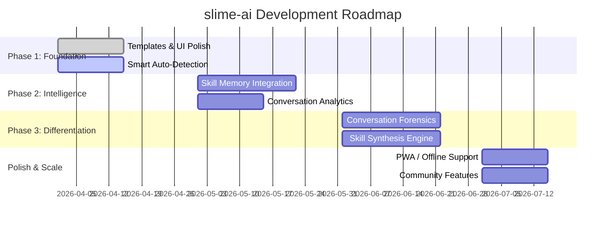

# 🟢 slime-ai

> **A lightweight, single-file AI chat interface with skill-based prompting, multi-provider support, and intelligent conversation tools.**

[](https://opensource.org/licenses/MIT)
[](https://react.dev)
[](https://www.typescriptlang.org)
[](https://vite.dev)
[](https://tailwindcss.com)

🌐 **Live Demo**: [nikhil00437.github.io/slime-ai](https://nikhil00437.github.io/slime-ai/)

---

## ✨ Features

### 🧠 Intelligent Chat Experience
| Feature | Description |
|---------|-------------|
| **🎯 Skill-Based Prompting** | Activate specialized personas: Code Expert, Creative Writer, Research Analyst, Teacher, Debate Partner & more |
| **🔄 Multi-Provider Support** | Connect to Ollama, LM Studio, OpenRouter, OpenAI, Anthropic, Gemini, xAI Grok — all in one place |
| **💬 Rich Message Rendering** | Full Markdown support with syntax highlighting, code blocks, and formatted responses |
| **📊 Cost & Token Tracking** | Real-time token usage and estimated cost display for every response |
| **🧵 Conversation History** | Persistent chat sessions with selective clear, pinning, and quick navigation |

### 🎨 Polished UI/UX
| Feature | Description |
|---------|-------------|
| **🎨 Clean, Modern Design** | Built with Tailwind CSS 4 — responsive, dark-mode ready, and buttery smooth |
| **👆 Touch Gestures** | Swipe left/right in sidebar for mobile-friendly navigation |
| **📎 Drag & Drop Files** | Drop images, code files, or documents directly into chat |
| **⌨️ Keyboard Shortcuts** | `Ctrl+K` for Command Palette, `Ctrl+H` for Help, arrow keys for input history |
| **✨ Visual Feedback** | Loading states, error toasts, streaming indicators, and skill activation glow effects |

### 🛠️ Developer-First Architecture
| Feature | Description |
|---------|-------------|
| **📦 Single-File Deployment** | Built with `vite-plugin-singlefile` — output is one portable `index.html` |
| **🔐 Local-First Privacy** | All data stays in your browser; API keys stored in localStorage (optional vault support) |
| **🧩 Modular Components** | Clean separation: `App.tsx`, `components/`, `store/`, `utils/`, `types.ts` |
| **🔧 Type-Safe TypeScript** | 99.5% TypeScript coverage with comprehensive interfaces for providers, skills, and messages |
| **🚀 Zero-Config Dev** | `npm run dev` and you're coding in seconds |

### 🔧 Advanced Capabilities *(Coming Soon / Roadmap)*
- 🧠 **Skill Memory**: Skills that remember your preferences and context
- 🔍 **Smart Auto-Detection**: Suggests skills based on your input patterns
- 📈 **Conversation Analytics**: Track which skills/models work best for you
- 🔄 **Skill Synthesis**: Auto-generate new skills from your successful conversations
- ⚡ **Tool Execution**: File system, web search, and bash tool integration (configurable)

---

## 🚀 Quick Start

### Prerequisites
- Node.js 18+ 
- npm or yarn or pnpm

### Installation
```bash
# Clone the repo
git clone https://github.com/Nikhil00437/slime-ai.git
cd slime-ai

# Install dependencies
npm install

# Start development server
npm run dev
```

👉 Open [http://localhost:5173](http://localhost:5173) in your browser.

### Configuration
1. **Set your API keys** (optional — works with local Ollama/LM Studio out of the box):
   ```bash
   # Copy the example env file
   cp .env.example .env.local
   ```
2. **Edit `.env.local`**:
   ```env
   # Example: OpenRouter
   VITE_OPENROUTER_API_KEY=your_key_here
   
   # Example: OpenAI
   VITE_OPENAI_API_KEY=sk-...
   ```
3. **Enable providers in-app**: Click the ⚙️ Settings icon → Providers → Toggle + add your key.

### Build & Deploy
```bash
# Build for production (outputs single index.html)
npm run build

# Preview production build locally
npm run preview

# Deploy to GitHub Pages
npm run deploy
```

✅ Your entire app is now a single `dist/index.html` file — drag it anywhere to run!

---

## 🧭 Project Structure

```
slime-ai/
├── 📄 index.html           # Single HTML entry point
├── 📄 vite.config.ts       # Vite + React + Tailwind + SingleFile config
├── 📄 package.json         # Dependencies & scripts
├── 📄 tsconfig.json        # TypeScript configuration
│
├── 📁 src/
│   ├── 📄 main.tsx         # React entry point
│   ├── 📄 App.tsx          # Main app component with tab navigation
│   ├── 📄 types.ts         # Comprehensive TypeScript interfaces
│   ├── 📄 index.css        # Tailwind base + custom utilities
│   │
│   ├── 📁 components/      # Reusable UI components
│   │   ├── ChatPanel.tsx   # Main chat interface
│   │   ├── Sidebar.tsx     # Conversation list + settings
│   │   ├── CommandPalette.tsx  # Ctrl+K quick actions
│   │   └── HelpPalette.tsx     # Ctrl+H help & shortcuts
│   │
│   ├── 📁 store/           # State management (Context API)
│   │   └── AppContext.tsx  # Global app state + actions
│   │
│   ├── 📁 slime/           # Core "Skill" system
│   │   └── SkillForge.tsx  # Create & manage custom skills
│   │
│   ├── 📁 api/             # Provider API adapters
│   ├── 📁 utils/           # Helper functions
│   ├── 📁 data/            # Static data & presets
│   └── 📁 assets/          # Icons, images, fonts
│
└── 📁 dist/                # Production build output (single HTML)
```

---

## 🎮 How to Use

### 1️⃣ Start a Chat
- Type your message in the input box at the bottom
- Press `Enter` to send, `Shift+Enter` for new line
- Use `↑`/`↓` arrows to cycle through previous inputs

### 2️⃣ Activate a Skill
- Click the **Skill icon** 💬 next to the input
- Choose from built-in skills:
  - 💻 **Code Expert**: Step-by-step reasoning, best practices, edge-case awareness
  - ✍️ **Creative Writer**: Storytelling, poetry, vivid prose
  - 🔬 **Research Analyst**: Structured breakdowns, citations, uncertainty flags
  - 🎓 **Teacher**: Socratic method, analogies, digestible explanations
  - ⚖️ **Debate Partner**: Steelman arguments, logical fallacy detection
- Or create your own in **Skill Forge** (🔬 tab)

### 3️⃣ Switch Providers & Models
- Open Settings (⚙️) → **Providers**
- Enable your preferred backend (Ollama, OpenAI, etc.)
- Select a model from the dropdown above the chat input

### 4️⃣ Pro Tips
| Shortcut | Action |
|----------|--------|
| `Ctrl+K` | Open Command Palette — quick actions, skill search, settings |
| `Ctrl+H` | Open Help — view all shortcuts & feature guide |
| `Ctrl+Shift+C` | Copy last response |
| `Ctrl+L` | Clear current conversation |
| `Swipe ←/→` | Navigate conversations (mobile) |

---

## 🧩 Extending slime-ai

### Add a New Skill
Edit `src/types.ts` and add to `DEFAULT_SKILLS`:
```typescript
{
  id: 'my-custom-skill',
  name: 'My Skill',
  description: 'What it does',
  systemPrompt: 'You are...',
  icon: '🎨',
  category: 'custom',
  builtIn: false,
  enabled: true,
  keywords: ['trigger', 'words', 'here'],
}
```

### Add a New Provider
1. Extend `ProviderType` in `src/types.ts`
2. Add config to `DEFAULT_PROVIDERS` array
3. Implement adapter in `src/api/` (follow existing pattern)

### Customize the UI
- All styling uses **Tailwind CSS 4** — edit `src/index.css` or use utility classes
- Components are modular — modify `src/components/` files directly
- Theme colors are CSS variables — easy to rebrand

---

## 🔐 Privacy & Security

- ✅ **No telemetry** — slime-ai doesn't phone home
- ✅ **Local storage** — conversations, settings, and keys stay in your browser
- ✅ **Bring your own keys** — API credentials are never sent to third parties (except your chosen provider)
- ✅ **Offline capable** — works with local LLMs (Ollama, LM Studio) without internet

> ⚠️ **Note**: When using cloud providers (OpenAI, Anthropic, etc.), your prompts are sent to their APIs per their terms. slime-ai does not intercept or log this traffic.

---

## 🗺️ Roadmap



**Next Up**:
- [ ] Smart suggestion banner ("Looks like you're coding — enable Code Expert?")
- [ ] Quick-access skill bar with hover previews
- [ ] Skill-specific memory injection
- [ ] "The Codex" dashboard for conversation insights

*Have an idea? Open an issue or PR!* 🙌

---

## 🤝 Contributing

Contributions are welcome! Here's how to get started:

1. **Fork** the repo
2. **Create a feature branch**: `git checkout -b feat/amazing-idea`
3. **Commit your changes**: `git commit -m 'feat: add amazing feature'`
4. **Push to your fork**: `git push origin feat/amazing-idea`
5. **Open a Pull Request** 🎉

### Development Guidelines
- ✅ Use TypeScript — no `any` unless absolutely necessary
- ✅ Follow existing component patterns in `src/components/`
- ✅ Add types to `src/types.ts` for new data structures
- ✅ Test locally with `npm run dev` before submitting
- ✅ Keep the single-file build working — test with `npm run build`

### Good First Issues
Look for issues labeled [`good first issue`](https://github.com/Nikhil00437/slime-ai/issues?q=is%3Aissue+is%3Aopen+label%3A%22good+first+issue%22) to get started.

---

## 📄 License

Distributed under the **MIT License**. See [`LICENSE`](LICENSE) for more information.

```
MIT License

Copyright (c) 2026 Nikhil

Permission is hereby granted, free of charge, to any person obtaining a copy
of this software and associated documentation files (the "Software"), to deal
in the Software without restriction, including without limitation the rights
to use, copy, modify, merge, publish, distribute, sublicense, and/or sell
copies of the Software, and to permit persons to whom the Software is
furnished to do so, subject to the following conditions:

The above copyright notice and this permission notice shall be included in all
copies or substantial portions of the Software.

THE SOFTWARE IS PROVIDED "AS IS", WITHOUT WARRANTY OF ANY KIND, EXPRESS OR
IMPLIED, INCLUDING BUT NOT LIMITED TO THE WARRANTIES OF MERCHANTABILITY,
FITNESS FOR A PARTICULAR PURPOSE AND NONINFRINGEMENT. IN NO EVENT SHALL THE
AUTHORS OR COPYRIGHT HOLDERS BE LIABLE FOR ANY CLAIM, DAMAGES OR OTHER
LIABILITY, WHETHER IN AN ACTION OF CONTRACT, TORT OR OTHERWISE, ARISING FROM,
OUT OF OR IN CONNECTION WITH THE SOFTWARE OR THE USE OR OTHER DEALINGS IN THE
SOFTWARE.
```

---

## 🙏 Acknowledgements

- [React](https://react.dev) — UI library that makes it all possible
- [Vite](https://vite.dev) — Blazing fast build tooling
- [Tailwind CSS](https://tailwindcss.com) — Utility-first styling
- [lucide-react](https://lucide.dev) — Beautiful, consistent icons
- [react-markdown](https://github.com/remarkjs/react-markdown) — Markdown rendering
- [vite-plugin-singlefile](https://github.com/richardtallent/vite-plugin-singlefile) — The magic behind single-file builds

---

> 💬 **Built with ❤️ by [Nikhil](https://github.com/Nikhil00437)**  
> *Got feedback? Found a bug? Want to collaborate?*  
> 🐛 [Open an Issue](https://github.com/Nikhil00437/slime-ai/issues) • 💡 [Start a Discussion](https://github.com/Nikhil00437/slime-ai/discussions) • 🚀 [View Roadmap](#-roadmap)

---

<p align="center">
  <sub>🟢 slime-ai — because great AI tools should be simple, portable, and yours.</sub>
</p>
